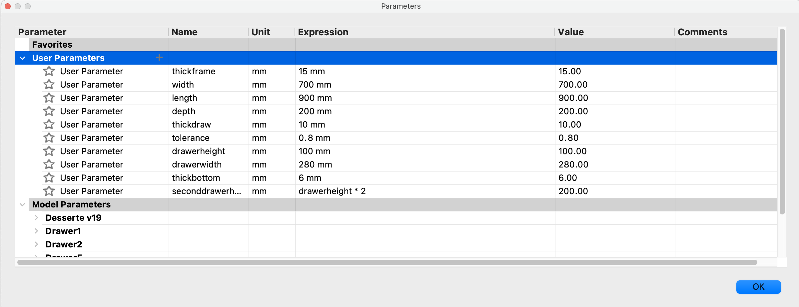

# SimpleCupboard by master-mugen

This is a simple, yet fully parametric, wallmounted cupboard I made for our doorway.

 

You can change width, length, depth, wood thickness and the size of the drawers.

